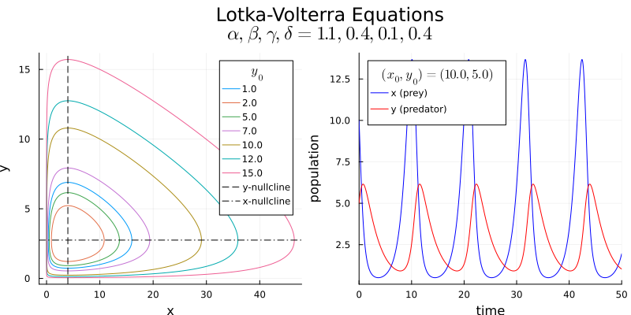
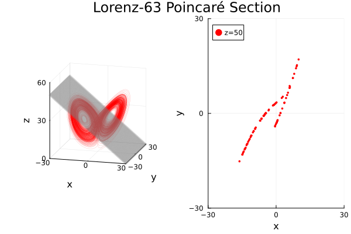

# Nonlinear Dynamics
[A Concise Introduction Interlaced with Code](https://link.springer.com/book/10.1007/978-3-030-91032-7)

## Exercise 2.5
[Code](https://github.com/ianwineman/nonlinear-dynamics/blob/main/exercises/exercise2_5.jl)

## Exercise 2.4
[Code](https://github.com/ianwineman/nonlinear-dynamics/blob/main/exercises/exercise2_4.jl)

## Figure 2.3
[Code](https://github.com/ianwineman/nonlinear-dynamics/blob/main/figures/fig2_3.jl)

## Exercise 1.19
[Code](https://github.com/ianwineman/nonlinear-dynamics/blob/main/exercises/exercise1_19.jl)

## Exercise 1.18
[Code](https://github.com/ianwineman/nonlinear-dynamics/blob/main/exercises/exercise1_18.jl)

## Exercise 1.16
[Code](https://github.com/ianwineman/nonlinear-dynamics/blob/main/exercises/exercise1_16.jl)

## Exercise 1.15
[Code](https://github.com/ianwineman/nonlinear-dynamics/blob/main/exercises/exercise1_15.jl)

## Exercise 1.17
[Code](https://github.com/ianwineman/nonlinear-dynamics/blob/main/exercises/exercise1_17.jl)

## Exercise 1.11
[Code](https://github.com/ianwineman/nonlinear-dynamics/blob/main/exercises/exercise1_11.jl)

## Exercise 1.10
[Code](https://github.com/ianwineman/nonlinear-dynamics/blob/main/exercises/exercise1_10.jl)

## Exercise 1.9
[Code](https://github.com/ianwineman/nonlinear-dynamics/blob/main/exercises/exercise1_9.jl)

## Exercise 1.8
[Code](https://github.com/ianwineman/nonlinear-dynamics/blob/main/exercises/exercise1_8.jl)

## Exercise 1.7
[Code](https://github.com/ianwineman/nonlinear-dynamics/blob/main/exercises/exercise1_7.jl)

## Exercise 1.6
[Code](https://github.com/ianwineman/nonlinear-dynamics/blob/main/exercises/exercise1_6.jl)

## Exercise 1.5
[Code](https://github.com/ianwineman/nonlinear-dynamics/blob/main/exercises/exercise1_5.jl)

