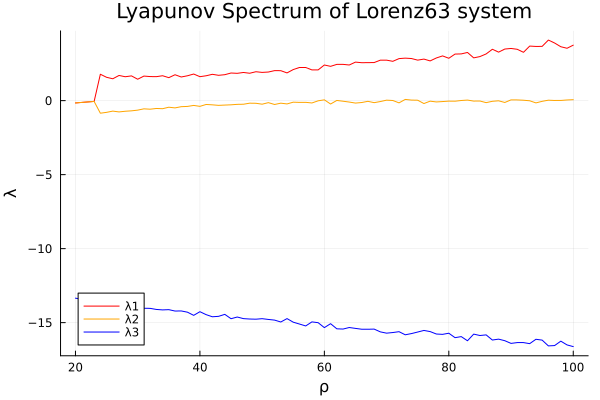
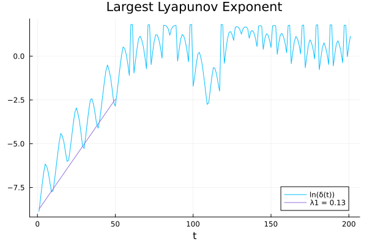
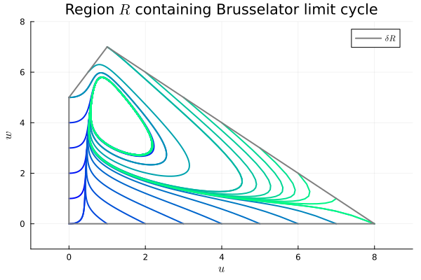
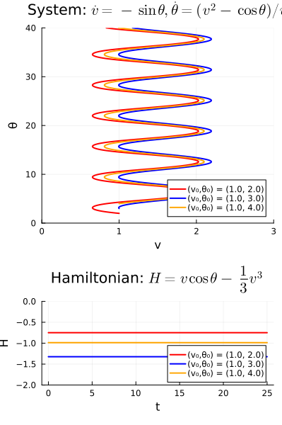
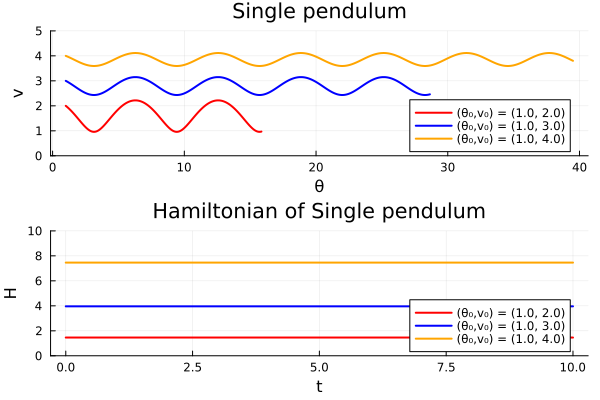

# Nonlinear Dynamics
[A Concise Introduction Interlaced with Code](https://link.springer.com/book/10.1007/978-3-030-91032-7)

## Exercise 6.2
[Code](https://github.com/ianwineman/nonlinear-dynamics/blob/main/exercises/6/exercise6_2.jl)

## Exercise 6.1
[Code](https://github.com/ianwineman/nonlinear-dynamics/blob/main/exercises/6/exercise6_1.jl)

## Exercise 5.13
[Code](https://github.com/ianwineman/nonlinear-dynamics/blob/main/exercises/5/exercise5_13.jl)

## Exercise 5.12
[Code](https://github.com/ianwineman/nonlinear-dynamics/blob/main/exercises/5/exercise5_12.jl)

## Exercise 5.11
[Code](https://github.com/ianwineman/nonlinear-dynamics/blob/main/exercises/5/exercise5_11.jl)

## Exercise 5.10
[Code](https://github.com/ianwineman/nonlinear-dynamics/blob/main/exercises/5/exercise5_10.jl)

## Exercise 5.9
[Code](https://github.com/ianwineman/nonlinear-dynamics/blob/main/exercises/5/exercise5_9.jl)

## Exercise 5.8
[Code](https://github.com/ianwineman/nonlinear-dynamics/blob/main/exercises/5/exercise5_8.jl)

## Exercise 5.7
[Code](https://github.com/ianwineman/nonlinear-dynamics/blob/main/exercises/5/exercise5_7.jl)

## Exercise 5.6
[Code](https://github.com/ianwineman/nonlinear-dynamics/blob/main/exercises/5/exercise5_6.jl)

## Exercise 5.4
[Code](https://github.com/ianwineman/nonlinear-dynamics/blob/main/exercises/5/exercise5_4.jl)

## Exercise 5.3
[Code](https://github.com/ianwineman/nonlinear-dynamics/blob/main/exercises/5/exercise5_3.jl)

## Figure 5.4
[Code](https://github.com/ianwineman/nonlinear-dynamics/blob/main/figures/figure5_4.jl)

## Exercise 4.18
[Code](https://github.com/ianwineman/nonlinear-dynamics/blob/main/exercises/4/exercise4_18.jl)

## Exercise 4.17
[Code](https://github.com/ianwineman/nonlinear-dynamics/blob/main/exercises/4/exercise4_17.jl)

## Exercise 4.16
[Code](https://github.com/ianwineman/nonlinear-dynamics/blob/main/exercises/4/exercise4_16.jl)

## Exercise 4.13
[Code](https://github.com/ianwineman/nonlinear-dynamics/blob/main/exercises/4/exercise4_13.jl)

## Exercise 4.12
[Code](https://github.com/ianwineman/nonlinear-dynamics/blob/main/exercises/4/exercise4_12.jl)

## Exercise 4.10
[Code](https://github.com/ianwineman/nonlinear-dynamics/blob/main/exercises/4/exercise4_10.jl)

## Exercise 4.9
[Code](https://github.com/ianwineman/nonlinear-dynamics/blob/main/exercises/4/exercise4_9.jl)

## Exercise 4.8
[Code](https://github.com/ianwineman/nonlinear-dynamics/blob/main/exercises/4/exercise4_8.jl)

## Exercise 4.7
[Code](https://github.com/ianwineman/nonlinear-dynamics/blob/main/exercises/4/exercise4_7.jl)

## Exercise 4.6
[Code](https://github.com/ianwineman/nonlinear-dynamics/blob/main/exercises/4/exercise4_6.jl)

## Exercise 4.5
[Code](https://github.com/ianwineman/nonlinear-dynamics/blob/main/exercises/4/exercise4_5.jl)

## Exercise 4.4
[Code](https://github.com/ianwineman/nonlinear-dynamics/blob/main/exercises/4/exercise4_4.jl)

## Exercise 4.3
[Code](https://github.com/ianwineman/nonlinear-dynamics/blob/main/exercises/4/exercise4_3.jl)

## Exercise 4.2
[Code](https://github.com/ianwineman/nonlinear-dynamics/blob/main/exercises/4/exercise4_2.jl)

## Exercise 3.16
[Code](https://github.com/ianwineman/nonlinear-dynamics/blob/main/exercises/3/exercise3_16.jl)

## Exercise 3.15
[Code](https://github.com/ianwineman/nonlinear-dynamics/blob/main/exercises/3/exercise3_15.jl)

## Exercise 3.14
[Code](https://github.com/ianwineman/nonlinear-dynamics/blob/main/exercises/3/exercise3_14.jl)

## Exercise 3.13
[Code](https://github.com/ianwineman/nonlinear-dynamics/blob/main/exercises/3/exercise3_13.jl)

## Exercise 3.7
[Code](https://github.com/ianwineman/nonlinear-dynamics/blob/main/exercises/3/exercise3_7.jl)

## Exercise 3.6
[Code](https://github.com/ianwineman/nonlinear-dynamics/blob/main/exercises/3/exercise3_6.jl)

## Exercise 3.5
[Code](https://github.com/ianwineman/nonlinear-dynamics/blob/main/exercises/3/exercise3_5.jl)

## Exercise 3.4
[Code](https://github.com/ianwineman/nonlinear-dynamics/blob/main/exercises/3/exercise3_4.jl)

## Exercise 3.2
[Code](https://github.com/ianwineman/nonlinear-dynamics/blob/main/exercises/3/exercise3_2.jl)

## Exercise 3.1
[Code](https://github.com/ianwineman/nonlinear-dynamics/blob/main/exercises/3/exercise3_1.jl)

## Exercise 2.2
[Code](https://github.com/ianwineman/nonlinear-dynamics/blob/main/exercises/2/exercise2_2.jl)

## Exercise 2.10
[Code](https://github.com/ianwineman/nonlinear-dynamics/blob/main/exercises/2/exercise2_10.jl)

## Exercise 2.9
[Code](https://github.com/ianwineman/nonlinear-dynamics/blob/main/exercises/2/exercise2_9.jl)

## Exercise 2.14
[Code](https://github.com/ianwineman/nonlinear-dynamics/blob/main/exercises/2/exercise2_14.jl)

## Exercise 2.12
[Code](https://github.com/ianwineman/nonlinear-dynamics/blob/main/exercises/2/exercise2_12.jl)

## Figure 2.6
[Code](https://github.com/ianwineman/nonlinear-dynamics/blob/main/figures/2/figure2_6.jl)

## Exercise 2.8
[Code](https://github.com/ianwineman/nonlinear-dynamics/blob/main/exercises/2/exercise2_8.jl)

## Exercise 2.11
[Code](https://github.com/ianwineman/nonlinear-dynamics/blob/main/exercises/2/exercise2_11.jl)

## Exercise 2.6
[Code](https://github.com/ianwineman/nonlinear-dynamics/blob/main/exercises/2/exercise2_6.jl)

## Exercise 2.5
[Code](https://github.com/ianwineman/nonlinear-dynamics/blob/main/exercises/2/exercise2_5.jl)

## Exercise 2.4
[Code](https://github.com/ianwineman/nonlinear-dynamics/blob/main/exercises/2/exercise2_4.jl)

## Figure 2.3
[Code](https://github.com/ianwineman/nonlinear-dynamics/blob/main/figures/figure2_3.jl)

## Exercise 1.19
[Code](https://github.com/ianwineman/nonlinear-dynamics/blob/main/exercises/2/exercise1_19.jl)

## Exercise 1.18
[Code](https://github.com/ianwineman/nonlinear-dynamics/blob/main/exercises/2/exercise1_18.jl)

## Exercise 1.16
[Code](https://github.com/ianwineman/nonlinear-dynamics/blob/main/exercises/1/exercise1_16.jl)

## Exercise 1.15
[Code](https://github.com/ianwineman/nonlinear-dynamics/blob/main/exercises/1/exercise1_15.jl)

## Exercise 1.17
[Code](https://github.com/ianwineman/nonlinear-dynamics/blob/main/exercises/1/exercise1_17.jl)

## Exercise 1.11
[Code](https://github.com/ianwineman/nonlinear-dynamics/blob/main/exercises/1/exercise1_11.jl)

## Exercise 1.10
[Code](https://github.com/ianwineman/nonlinear-dynamics/blob/main/exercises/1/exercise1_10.jl)

## Exercise 1.9
[Code](https://github.com/ianwineman/nonlinear-dynamics/blob/main/exercises/1/exercise1_9.jl)

## Exercise 1.8
[Code](https://github.com/ianwineman/nonlinear-dynamics/blob/main/exercises/1/exercise1_8.jl)

## Exercise 1.7
[Code](https://github.com/ianwineman/nonlinear-dynamics/blob/main/exercises/1/exercise1_7.jl)

## Exercise 1.6
[Code](https://github.com/ianwineman/nonlinear-dynamics/blob/main/exercises/1/exercise1_6.jl)

## Exercise 1.5
[Code](https://github.com/ianwineman/nonlinear-dynamics/blob/main/exercises/1/exercise1_5.jl)

